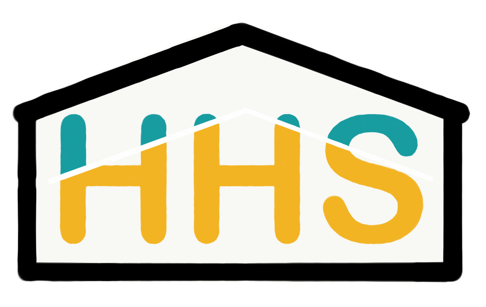

# HomeEasy

<!-- Improved compatibility of back to top link: See: https://github.com/othneildrew/Best-README-Template/pull/73 -->
<a name="readme-top"></a>
<!--
*** Thanks for checking out the Best-README-Template. If you have a suggestion
*** that would make this better, please fork the repo and create a pull request
*** or simply open an issue with the tag "enhancement".
*** Don't forget to give the project a star!
*** Thanks again! Now go create something AMAZING! :D
-->


<!-- PROJECT SHIELDS -->
<!--
*** I'm using markdown "reference style" links for readability.
*** Reference links are enclosed in brackets [ ] instead of parentheses ( ).
*** See the bottom of this document for the declaration of the reference variables
*** for contributors-url, forks-url, etc. This is an optional, concise syntax you may use.
*** https://www.markdownguide.org/basic-syntax/#reference-style-links
-->
[![Contributors][contributors-shield]][contributors-url]
[![Forks][forks-shield]][forks-url]
[![Stargazers][stars-shield]][stars-url]


<!-- PROJECT LOGO -->
<br />
<div align="center">
  <a href="https://github.com/thartzler/HomeEasy">
    
  </a>

<h3 align="center">HomeEasy</h3>

  <p align="center">
    For my capstone project, I will be designing and building a web application that will be useful for those looking to rent an apartment and those who lease their properties. The main functions of the application will be to allow potential tenants to submit rental applications, landlords to setup properties for lease, record rent payments, and exiting tenants to calculate their upcoming rent payments.
    <br />
    <a href="https://github.com/thartzler/HomeEasy"><strong>Explore the docs »</strong></a>
    <br />
    <br />
    <a href="https://github.com/thartzler/HomeEasy">View Demo</a>
    ·
    <a href="https://github.com/thartzler/HomeEasy/issues">Report Bug</a>
    ·
    <a href="https://github.com/thartzler/HomeEasy/issues">Request Feature</a>
  </p>
</div>


<!-- TABLE OF CONTENTS -->
<details>
  <summary>Table of Contents</summary>
  <ol>
    <li>
      <a href="#about-the-project">About The Project</a>
      <ul>
        <li><a href="#built-with">Built With</a></li>
      </ul>
    </li>
    <li>
      <a href="#getting-started">Getting Started</a>
      <ul>
        <li><a href="#prerequisites">Prerequisites</a></li>
        <li><a href="#installation">Installation</a></li>
      </ul>
    </li>
    <li><a href="#usage">Usage</a></li>
    <li><a href="#roadmap">Roadmap</a></li>
    <li><a href="#contributing">Contributing</a></li>
    <li><a href="#license">License</a></li>
    <li><a href="#contact">Contact</a></li>
    <li><a href="#acknowledgments">Acknowledgments</a></li>
  </ol>
</details>


<!-- ABOUT THE PROJECT -->
## About The Project

<!-- [![Product Name Screen Shot][product-screenshot]](https://example.com) -->

This project originated in response to the requirements of the Capstone project for Maryville's Masters of Software Development program.
My parents have multiple rental properties and it can be challenging at times to keep track of all the applications, tenant payments, etc.
The application is expected to address a few of those issues.

<p align="right">(<a href="#readme-top">back to top</a>)</p>


### Built With

* [![Bootstrap][Bootstrap.com]][Bootstrap-url]

<p align="right">(<a href="#readme-top">back to top</a>)</p>


<!-- GETTING STARTED -->
## Getting Started

Currently this repo is used for personal use only during the duration of the course.
As the project progresses, this document will be updated with instructions of how to download it and get it running on your local machine.
For now, to get a local copy up and running please contact me.

### Prerequisites

This is an example of how to list things you need to use the software and how to install them.
* npm
  ```sh
  npm install npm@latest -g
  ```

### Installation

This Section TBD as the project progresses
1. Get a free API Key at [https://example.com](https://example.com)
2. Clone the repo
   ```sh
   git clone https://github.com/thartzler/HomeEasy.git
   ```
3. Install NPM packages
   ```sh
   npm install
   ```
4. Enter your API in `config.js`
   ```js
   const API_KEY = 'ENTER YOUR API';
   ```

<p align="right">(<a href="#readme-top">back to top</a>)</p>


<!-- Demo Site -->
## DEMO

The application will be avaialable as a subscription service to landlords. It's free to sign up as a tenant.

_For a demo, please refer to the [Demo site](http://demo.hartzlerhome.solutions)_

<p align="right">(<a href="#readme-top">back to top</a>)</p>


<!-- ROADMAP -->
## Roadmap

- [ ] Signup for Application (companies)
- [ ] Create Account
- [ ] Add / Edit Properties
- [ ] Lease
    - [ ] Create Leases and generate QR Code with link to application
    - [ ] Submit Lease Applications
    - [ ] Review Lease applications
- [ ] Landlord enter rent payments
- [ ] Tenant view rent
    - [ ] Calculate payments
    - [ ] View and download Receipts
- [ ] Tenant view and download payment receipts

See the [open issues](https://github.com/thartzler/HomeEasy/issues) for a full list of proposed features (and known issues).

<p align="right">(<a href="#readme-top">back to top</a>)</p>


<!-- CONTRIBUTING -->
## Contributing

Contributions are what make the open source community such an amazing place to learn, inspire, and create. Any contributions you make are **greatly appreciated**.

If you have a suggestion that would make this better, please fork the repo and create a pull request. You can also simply open an issue with the tag "enhancement".
Don't forget to give the project a star! Thanks again!

1. Fork the Project
2. Create your Feature Branch (`git checkout -b feature/AmazingFeature`)
3. Commit your Changes (`git commit -m 'Add some AmazingFeature'`)
4. Push to the Branch (`git push origin feature/AmazingFeature`)
5. Open a Pull Request

<p align="right">(<a href="#readme-top">back to top</a>)</p>


<!-- CONTACT -->
## Contact

Trevin Hartzler - thartzler1@live.maryville.edu

Project Link: [https://github.com/thartzler/HomeEasy](https://github.com/thartzler/HomeEasy)

<p align="right">(<a href="#readme-top">back to top</a>)</p>


<!-- ACKNOWLEDGMENTS -->
## Acknowledgments

* []()
* []()
* []()

<p align="right">(<a href="#readme-top">back to top</a>)</p>


<!-- MARKDOWN LINKS & IMAGES -->
<!-- https://www.markdownguide.org/basic-syntax/#reference-style-links -->
[best-README-Template]: https://github.com/othneildrew/Best-README-Template.git
[contributors-shield]: https://img.shields.io/github/contributors/thartzler/HomeEasy.svg?style=for-the-badge
[contributors-url]: https://github.com/thartzler/HomeEasy/graphs/contributors
[forks-shield]: https://img.shields.io/github/forks/thartzler/HomeEasy.svg?style=for-the-badge
[forks-url]: https://github.com/thartzler/HomeEasy/network/members
[stars-shield]: https://img.shields.io/github/stars/thartzler/HomeEasy.svg?style=for-the-badge
[stars-url]: https://github.com/thartzler/HomeEasy/stargazers
[issues-shield]: https://img.shields.io/github/issues/thartzler/HomeEasy.svg?style=for-the-badge
[Bootstrap-url]: https://getbootstrap.com